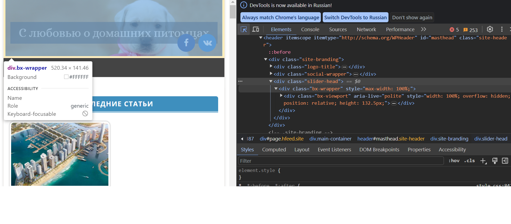
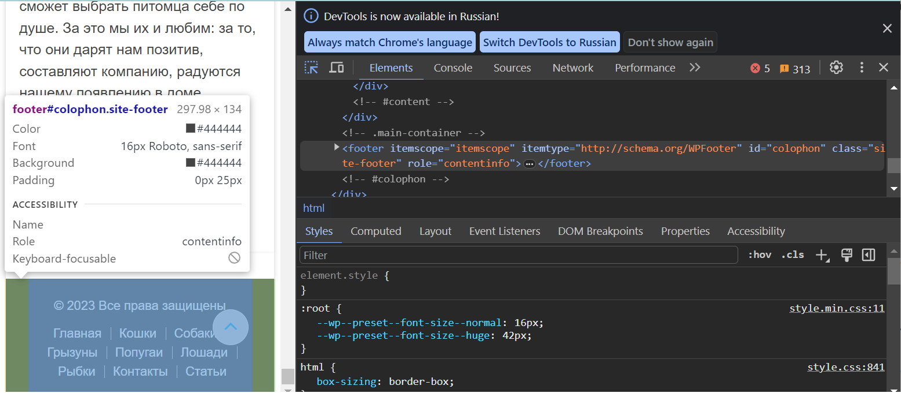
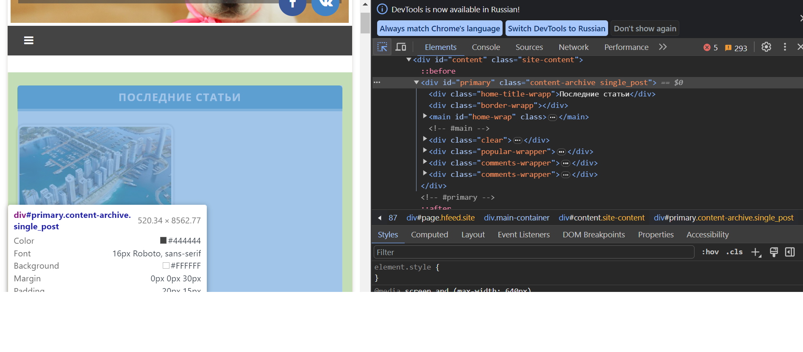
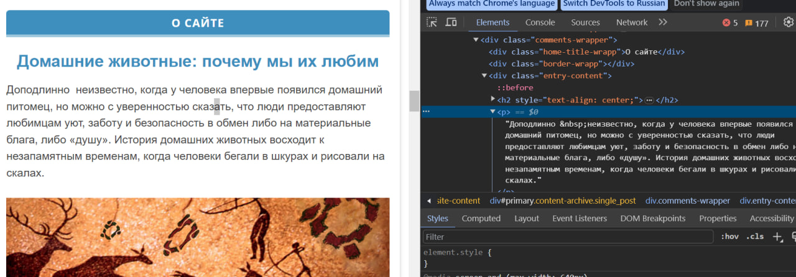
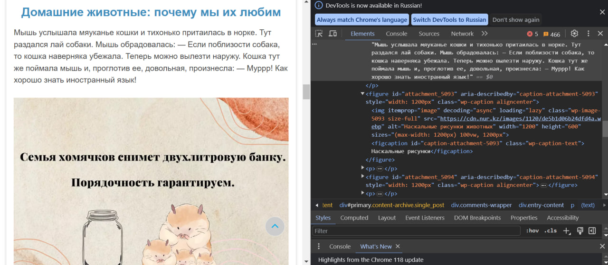
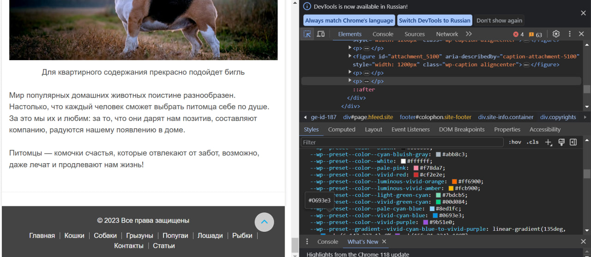
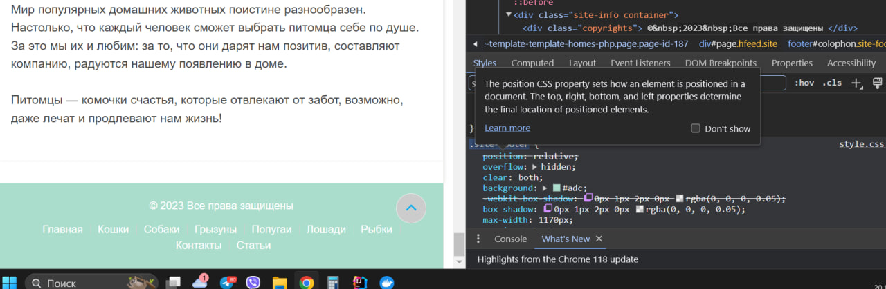
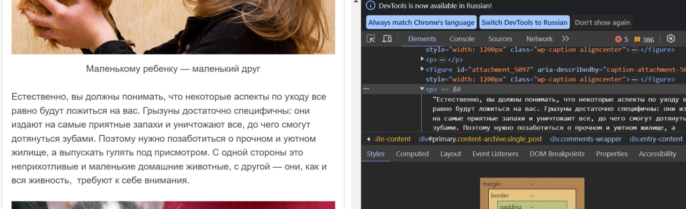
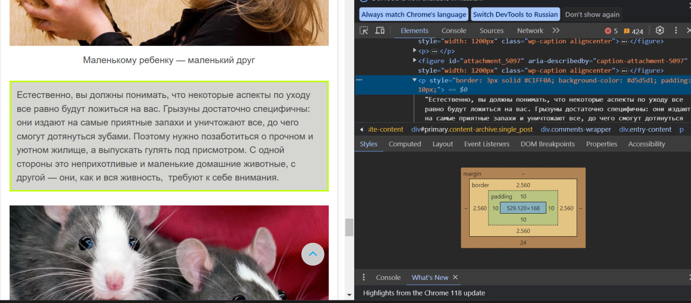
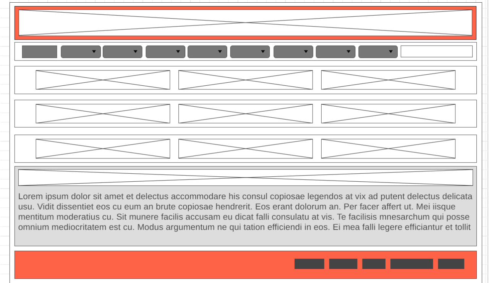

# web-hw1
Урок 1. Веб-технологии: вчера, сегодня, завтра

Задача: на основе сайта https://pet7.ru/

- Определите, на каком протоколе работает сайт.

- Проанализируйте структуру страницы сайта. Покажите в коде где хедер, футер и контент.

### Header

### Footer

### Content

- Внесите не менее 3 изменений на страницу с помощью инструмента разработчика и представьте скриншоты было/стало.

  ### Изменение 1

  Изменен текст и картинка

  #### До
  
  ### После
   

    ### Изменение 2

    Изменен цвет футтера

    #### До
    
    ### После
     

    ### Изменение 3

    Добавлена рамка для пораграфа и цвет фона внутри рамки

    #### До
    
    ### После
     

  
- Создайте прототип низкой детализации.

  

